# Peach_Fuzz

[TOC]

## Peach工具的基本结构

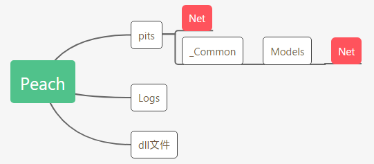

这里只列出了平时建模测试的时候常用的几个目录

根目录下的dll文件是调用系统函数用的文件，有的时候Peach工具在使用过程中报错有可能是因为版本问题导致dll文件不通无法调用系统函数或调用异常，此时可以更换Peach版本来尝试解决。

## Peach Fuzz核心组件

主要分为三大块：变异器（模糊器）、监控器、测试对象建模（数据格式/协议状态/API参数等等）

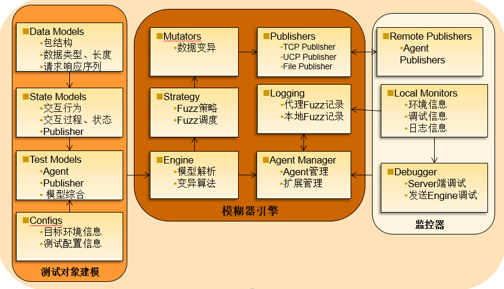

Peach Fuzz根据提供的测试套模拟发送含有变异数据的数据包，并监控被测环境是否出现异常来寻找漏洞。

左侧是对测试对象的描述，也就是告诉Peach工具测试对象表现出来的特征，告诉Peach如何和测试对象进行交互和发送数据。

中间是Peadh的模糊器引擎，一般不用测试人员去处理，只需要了解其功能和调用方法，就像使用函数一样使用即可。

右侧是Peach的监控器，用来监控被测对象是否出现异常。测试人员需要根据具体情况选择合适的监控器部署位置和监控器的种类。好的选择策略可以Peach工具的测试结果更加准确。


## 测试对象建模

测试对象建模就是写测试套。一般测试套分为四个部分，有些需要脚本协助的协议需要额外的python脚本作为测试套的第五个部分，下面分别说明

### 数据模型

数据模型就是使用XML格式的语言描述被测产品数据包的格式以及内容。通常有自动化的工具来辅助建模，后面会提到。

数据模型是否贴合真是数据包是决定测试套是否能跑通的关键，有的时候哪怕只是一个字节的错误也会造成首发异常，必须严格按照数据包协议格式建模。其中的难点，也是Peach工具的特点就是可以描述数据和数据之间的关系。我们都知道在数据包中经常会有描述数据包某部分长度的字段，也有一些根据前面数据包中数据而变化的字段。这些都要在数据模型建模中体现出来。

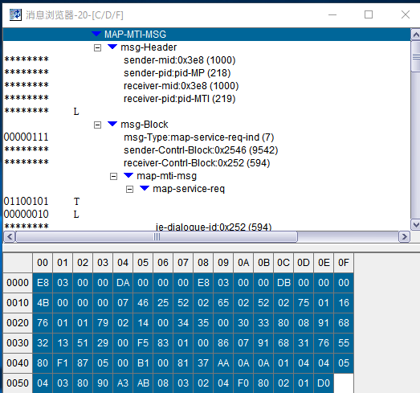

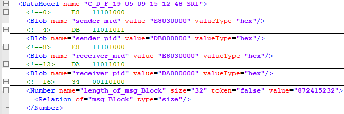

我截取了一个数据包和一段数据模型中的代码，代码中表示的就是数据包中**Header**字段。可以看到数据模型的本质就是**尽可能地准确描述数据包**。

简单解释一下其中的含义，**Blob**表示一个二进制大对象或者字节数组，常常用于代表缺少类型定义的或格式的数据。其中的属性可以根据名字望文生义。

注意代码的**最后三行**，定义了一个数字型的字段标签为Number，它的子标签表示了这个标签与数据包内其他字段的关系。在这三行里面表示这个Number型的字段是数据模型中**msg_Block**字段的长度。

### 状态模型

状态模型是告诉Peach工具怎么和被测目标进行交互，即怎么给目标发送数据和怎么接受目标数据。

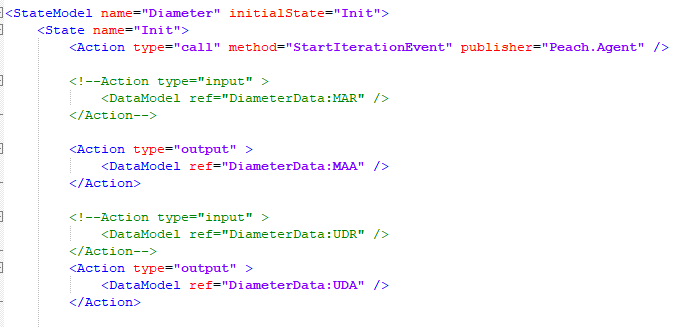

这是我截取的一段状态模型，其中有一个标签**Action**是状态模型告诉Prach工具要执行什么动作。首先第一个就是一个调用操作，指明了要从哪里调用什么方法。下面四个Action是输入输出操作，也就是和程序交互的过程。其中的数据模型标签可以直接引用已经在数据模型中创建好的数据模型。

引用之前需要将数据模型引入

```XML

```

如果需要调用python程序来处理输入输出数据，可用如下方法导入python目录

```XML
<PythonPath path=路径 />
```

如果需要发送之前收到的数据，需要使用**slurp**标签，举个例子来说

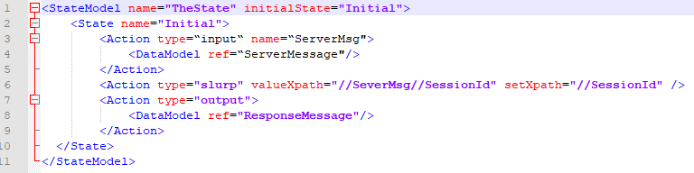

Slurp用于数据模型之间的数据移动，在不通Action下数据模型中数据字段取值并赋值。

上图中的场景为服务器返回的**SessionId**为定值，需要客户端发送请求的时候携带。

第一个Action为接收**ServerMessage**数据模型中对应位置的数据，然后通过**slurp**这个Action取**ServerMsg/SessionID**并将这个值赋给**SessionId**，然后紧跟下一个将含有此**SessionId**的数据模型数据包**ResponseMessage**发送。

### 模型综合

这个文件是被Peach工具直接调用的文件，里面主要需要配置四样东西。

#### 监控器

文件中的标签为**Agent**，用来检测被测产品是否出现异常。监控分为两种，**Local Agent**和**Remote Agent**，如果选择后者则需要开启

```shell
../peach -a tcp
```

负责只能进行本地监控。

监控器在Peach编写中是可选项，但想要更好的发现问题和监控设备却是必不可少的。当被测设备出现异常时，监控器会报fault，执行中的peach会记录出现问题的报文，并记录log，放便后续对问题的定位。常用的监控器有

> ping、pcap、ssh、windebug、linuxcrash、syslog等

#### 发包器

定义一个**Publisher**标签，字标签为参数，例如

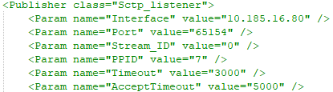

根据被测产品的特点选择合适的发包器。一般会根据通信协议层选择，也可以根据需求选择。常用的发包器

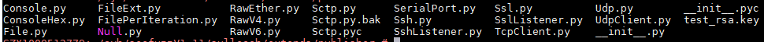

#### 日志

定义一个**Logger**标签，记录日志，例如

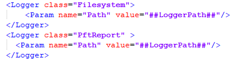

#### 变异策略

定义一个**Strategy**标签，选择变异策略，例如


Peach工具的变异功能很强大，如图

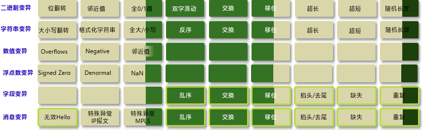

看到有多种变异对象和不同的变异方法，从**值、位置、数量**三个维度进行变异，基本囊括了模糊测试所需要的。

Peach帮我们将着许许多多编译方法组合为三种编译策略

> Random（随机）、Sequential（顺序）、RandomDeterministic（有范围的随机）

##### Random

随即策略无限次数的运行，对于每一个选定的元素随机选择其中一个相应的突变器。根据一个提供的**seed（种子）**进行变异，可以使用

```shell
--seed 指定种子值
```

绝大多数使用Peach进行Fuzz测试选用这个策略。

##### Sequential

对数据模型中的每个元素进行Fuzz测试，将所有的突变运用于每一个元素，指导所有可能的突变用尽。此模式下种子固定为31337。

##### RandomDeterministic

这种变异策略定义了开始和结束，有些类似于Sequential策略，但是它的突变顺序是打乱的，种子可以字迹指定。

#### 测试环境配置

此处可以定义一些有关于测试套和被测目标的配置，这样可以在更改测试套的时候省时省力。有点类似于编程语言语法中的define语句。同时也定义和被测目标通信的网卡，接口等等。根据被测目标的具体情况（如操作系统）进行灵活调整。

#### python辅助脚本

对于Peach无法实现的功能可以另加python脚本来实现。比如接收到的数据是加密的，需要进行解密。就可以写一个python脚本来进行加密解密。又比如有些数据包太大需要分片发送，也可以用python脚本来实现。一言以蔽之就是**python脚本是用来实现Peach工具实现不了但又在一些测试中确实需要的功能**。

## Peach工具的使用

### 运行

Peach使用很方便，在命令行中执行即可，在Windows和Linux上都可以运行.

再Linux上需要先安装**mono**模块和**libpacp**，可以在**《Peach工具使用指导书》**中找到详细的步骤。

Peach命令的执行需要进入pits目录底下，运行

```shell
../peach Net/要执行的测试套 --range 次数  
```

### 快速建模

面对抓到的数据包可以使用工具进行自动化建模

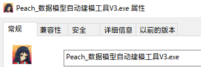

工具的使用方法也很简单，在工具GUI设置Peach工具的根目录和抓包文件的根目录，点击自动生成即可。

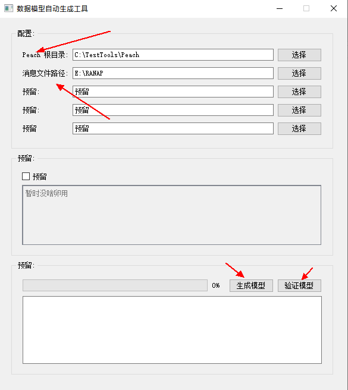

注意抓包需要**保存txt和bin**两种格式的文件。txt格式用来生成数据模型，bin格式则是用来验证生成的数据模型是否正确。如果存在出入，需要手动的去调节。


## 可能出现的问题

### 工具

一些工具安装中和在建立和被测产品链路中可能遇到的问题我已经写在了[这里](../SUSE/SUSE.md)。

### 使用

我将在近一个月的工作中遇到的问题整理归纳，总结出有一下几种。

#### 语法问题

以slurp为代表，注意valueXpath是取值、setXpath是赋值。它操作的是两个Action而不是数据模型。

#### 数据模型问题

注意数据模型中字段的关系，有些字段是要根据上下文决定的，要设置slurp、Relation或者python脚本进行操作。

#### dll文件问题

有些测试套需要的dll文件在某些版本的Peach工具确实，可以更换工具版本解决。

